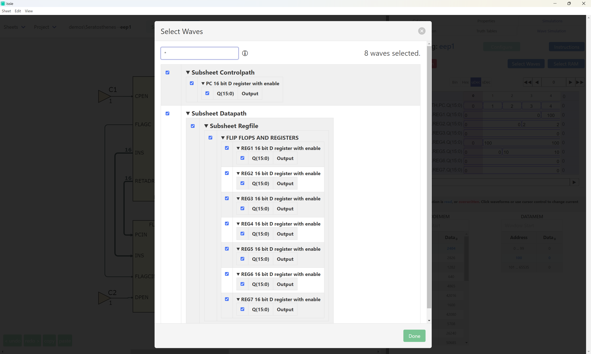
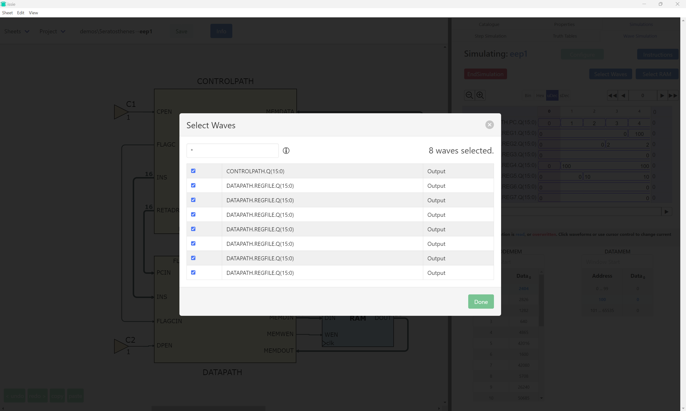

# HLP25CodeB README

GitHub Username: MaminM
## Table of Contents

- [How to Run and Test](#how-to-run-and-test)
- [GitHub Perma-Links for Code Components](#github-perma-links-for-code-components)
- [Additional Information (Including Demos)](#additional-information)

This repository contains the F# implementation for the HLP25 project, focusing on the waveform selection and display functionality. The primary goal of this implementation is to create a hierarchical tree structure for displaying waveforms in a waveform selector. The tree structure is designed to organize waveforms into sheets, components, and ports, allowing for efficient navigation and selection.

The key components of this implementation include:

* **Type definitions for** `WTNode`

- **`makeWaveDisplayTree`**: This function constructs a hierarchical tree structure (`WaveDisplayTree`) from a `WaveSimModel`. The tree organizes waveforms into sheets, components, and ports, and allows for dynamic flattening of nodes.
	- The condition for flattening have been **abstracted into functions that can be easily modified** `shouldFlattenSheet` `shouldFlattenGroup` `shouldFlattenComponent`

- **Tree Optimization and Validation**: The implementation includes functions to optimize the tree structure (`optimiseSheet`) and validate its integrity (`validateSheet`, `validateGroup`, `validateComponent`, `validatePortNode`).

- **`implementWaveSelector`**: This function converts the hierarchical tree structure into a React element that can be displayed in the waveform selector. It uses checkboxes and clickable elements to allow users to hide/show nodes and select/deselect waveforms.

- **Second tree implementation:** Worked substantially on a second implementation of a `WaveDisplayTree` constructor. It was first build and then optimised based on similarly abstracted functions to `shouldFlattenX`


---

## How to Run and Test

- The code can be located in the `indiv-check-aam522` branch, specifically in the [WaveSimSelect.fs](https://github.com/MaminM/issie/blob/2e763424a6fbfcf4ff55e3bc8aefc307330e130c/src/Renderer/UI/WaveSim/WaveSimSelect.fs#L774-L778) file.

- To test the functionality, comment out the line
```f-sharp
|> makeSheetRow showDetails ws dispatch []
```

and uncomment the following lines
```
|> makeWaveDisplayTree ws showDetails  
|> implementWaveSelector ws dispatch 
```

The conditions for flattening currently are simple. However, they can be made complicated and tested with. 
---

## GitHub Perma-Links for Code Components

For assessment purposes, please refer to the following permanent links which show the relevant code and the history (via GitHub blame):

- **`makeWaveDisplayTree` Function:**  
  [Permanent Link to `makeWaveDisplayTree` Implementation](https://github.com/MaminM/issie/blob/851a8772ff741701123f65cd08815629fbabbf64/src/Renderer/UI/WaveSim/HLP25CodeB_aam522.fs#L61-L238)  
  *(This link covers the entire tree construction function as modified on my check branch.)*

- **`implementWaveSelector` Function:**  
  [Permanent Link to `implementWaveSelector` Implementation](https://github.com/MaminM/issie/blob/2e763424a6fbfcf4ff55e3bc8aefc307330e130c/src/Renderer/UI/WaveSim/WaveSimSelect.fs#L601-L725)  
  *(This link covers the implementation of the waveform selector UI.)*

- **Tree Optimization and Validation Functions:**  
  [Permanent Link to Tree Optimization and Validation Code](https://github.com/MaminM/issie/blob/851a8772ff741701123f65cd08815629fbabbf64/src/Renderer/UI/WaveSim/HLP25CodeB_aam522.fs#L245-L265)  
  *(This shows the functions used to validate the tree structure. Not currently used)*

- **`shouldFlattenX` Funtions:**
  [Permanent Link to `shouldFlattenX` Function](https://github.com/MaminM/issie/blob/2e763424a6fbfcf4ff55e3bc8aefc307330e130c/src/Renderer/UI/WaveSim/HLP25CodeB_aam522.fs#L77-L103)
  *(This functions dictate, the structure of the display)*

- **Second Tree Implementation**
  [Permanent Link to the Second Tree Implementation](https://github.com/MaminM/issie/blob/0f1c049ea26ef773ab25c5ad1631f7e07b4602e9/src/Renderer/UI/WaveSim/HLP25CodeB_aam522.fs#L420-L522)
  *(Did not finish, however, due to the different abstractions used, I decided it was worth being marked)*

---

## Additional Information

- **Design Decisions:**  
  The design choices aim to improve code quality and user experience by:
  - **Smart Flattening made Easy:** The main aim of my design was to allow for anyone (more immediately Team Oak) to play around with how the wave display can be modified without having know much about the surrounding data types. The ultimate goal of this _dynamic flattening_ is to improve user experience through readability.
  - **Hierarchical Organization:** The tree structure organizes waveforms into sheets, components, and ports, making it easier for users to navigate and select waveforms.
  - **Validation:** The tree is validated to ensure that it adheres to the expected structure, preventing errors in the UI.

- **Testing:**  
  Testing can be done 

- **Future Work:**  
  Future improvements could include:
  - Adding more sophisticated filtering options for waveforms. `shouldFlattenSheet`, `shouldFlattenGroup` and `shouldFlattenComponent`
  - Enhancing the UI to provide more detailed information about each waveform.


### Demo

**Before**



**After**


 
---
*This README is intended to ensure that all modifications can be clearly identified using GitHub blame, and that the integration into the larger project is seamless.*