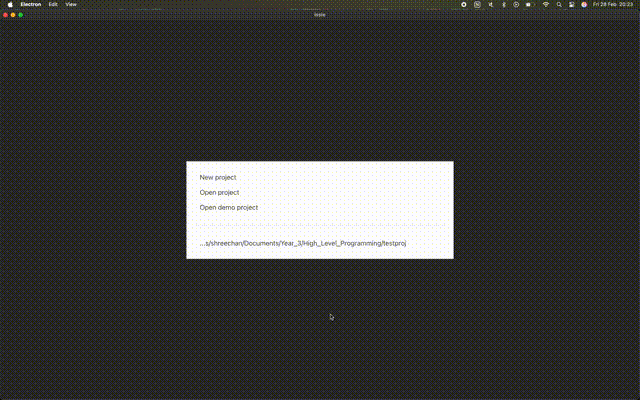

# README - `sc3321`

## Wave Selection & Display: Overview of Changes

This document outlines the new or refactored functionality I have added to Issie for wave selection and display. It focuses on two primary functions:

- **`selectWavesHlp25`**: A simplified (“MVP”) approach that presents waves in a flatter, user‐friendly structure.  
- **`makeWaveDisplayTree`**: A theoretical/higher‐level function that constructs a tree data structure for waveforms, enhancing abstraction and setting the stage for future hierarchical displays.

---

## 1. `selectWavesHlp25` and the Flat List

### Purpose
`selectWavesHlp25` provides a **cut‐down** or **MVP** version of wave selection. It handles:

- Filtering waves (e.g., `"*"` to show only selected waves).
- Passing the filtered waves to a **flat list** UI (`makeFlatList`) so the user sees a more concise display without overwhelming detail.

### Highlights
- **Minimal & Clean**: The flat list approach clusters waves by **component** (and potentially by subSheet), so large designs do not clutter the screen.  
- **Refactored**: The filtering existed previously, but I consolidated and tidied it within `selectWavesHlp25`.  
- **Integration**: The function simply returns a `WaveSelectionOutput` (list of waves + a boolean for “show details”). I then feed it to `renderWaves`, which calls `makeFlatList`.

### How to View or Test
- **Run** Issie as normal, open **Wave Simulation** → **Select Waves**.  
- **Type `"*"`** in the search box on any large design (e.g. the Eratosthenes demo) to see the final grouping.  
- Observe the waves grouped neatly by component or subSheet, making them easier to navigate.

---

## 2. `makeFlatList` Function

### Role
- `makeFlatList` is **responsible** for building the UI once we have a set of waves to display.  
- It groups waves by **subSheet** first, then by **component**.  
- Produces a **table** or structured layout, using `makeFlatGroupRow` for each group.

### Flow
1. **Group by subSheet**: e.g., “DATAPATH,” “CONTROLPATH,” “Top‐Level,” etc.  
2. **Within each subSheet**, group by component (like “REGFILE,” “ALU,” etc.).  
3. **Render** each group row using `makeFlatGroupRow`.  

This results in a “flat but organized” interface:  
- Top lines for each subSheet,  
- Sub‐rows for each component in that subSheet,  
- Potential wave detail within those groups.

---

## 3. `makeWaveDisplayTree` (Theoretical Abstraction)

### Purpose
While `selectWavesHlp25` and `makeFlatList` provide a working, flat approach, **`makeWaveDisplayTree`** explores a **more abstract tree** representation. It:

- Gathers the final wave list.  
- Constructs a nested **tree structure** (e.g. subSheet → component → leaf wave) for potential advanced UIs.  
- Returns a `WaveDisplayTree` (list of `WaveTreeNode`) that can then be rendered by a future `implementWaveSelector` function.

### Current Status
- I’ve outlined a **first-pass** approach that groups waves in a tree.  
- **No** advanced logic (like flattening single‐child branches) is implemented yet.  
- Future expansions: e.g., specialized match statements to tailor the hierarchy for different user conditions.

### Why This Matters
- Strong **abstraction**: We separate “**how** to build a tree” from “**how** to display it.”  
- Potential for a **smarter** hierarchical display that changes based on user input or wave count.  
- Sets up a base for collaborative improvements in the final group product.

---

## 4. How to Run & Where to Access

- **Branch**: `indiv-check-sc3321`.
- I have made changes in this branch to WaveSimSelect since it will not be merged with the rest of the group. This was also to allow you to see a working function. The isolated code, is contained in the HLPCodeBsc3321.fs file.   
- **Permalinks**:  
  - [**`selectWavesHlp25`** and related code](https://github.com/MaminM/issie/blob/96a599c3c2b09d3a1143ea203a54239ccd28eb13/src/Renderer/UI/WaveSim/HLP25CodeBsc3321.fs#L145)  
  - [**`makeFlatList`** code](https://github.com/MaminM/issie/blob/96a599c3c2b09d3a1143ea203a54239ccd28eb13/src/Renderer/UI/WaveSim/HLP25CodeBsc3321.fs#L237)  
  - [**`makeWaveDisplayTree`** skeleton](https://github.com/MaminM/issie/blob/96a599c3c2b09d3a1143ea203a54239ccd28eb13/src/Renderer/UI/WaveSim/HLP25CodeBsc3321.fs#L40)

**Steps to see it live**:  
1. Build the project. 
2. Launch the simulator.  
3. Choose Wave Simulation → Select Waves → type `"*"` or any substring to filter.  
4. Observe the newly structured wave listing.

---

## 5. Final Remarks

- **Clean UI**: The MVP approach focuses on not overwhelming the user, so the “flat list + grouped by subSheet/component” design is helpful for large designs.  
- **Future Work**: If time permits, the `makeWaveDisplayTree` approach can be expanded to produce a truly hierarchical UI with dynamic expansions, bridging the gap between a simple flat list and a fully nested navigation.  

