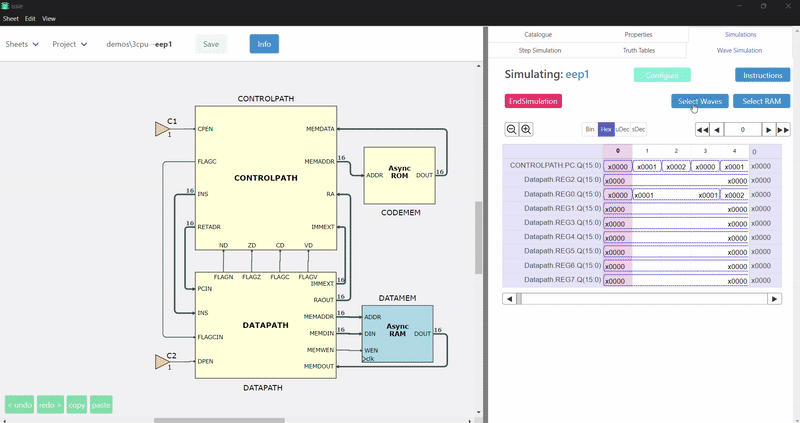
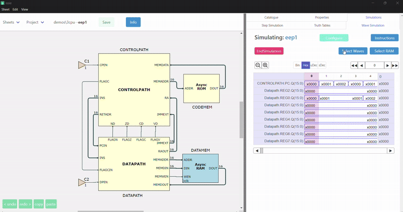

# HLP25CodeBsn722 README

GitHub Username: Nimosteve88

## Table of Contents

- [How to Run and Test](#how-to-run-and-test)
- [GitHub Perma-Links for Code Components](#github-perma-links-for-code-components)
- [Additional Information (Including Demos)](#additional-information)

This repository contains the F# implementation for the HLP25 project, with significant modifications to the waveform selection and breadcrumb display functionality. In particular, I have focused on improving the following functions:

- **`waveSelectBreadcrumbs`**  
  This function has been refactored to extract filtering logic, normalize string comparisons, and clearly determine the display attributes (e.g. color and match count) for each sheet breadcrumb. This helps make the breadcrumb display responsive to user search input.

- **`selectWavesModalHlp25`**  
  The modal dialog for selecting waves has been improved by isolating the modal-close logic into helper functions, providing clear separation between UI layout and state-update logic, and ensuring a robust reset of search parameters upon closure.

Additionally, I have modified portions of the commented helper code (at the bottom of the file) used for constructing breadcrumbs in `MiscMenuView` to incorporate a new field (`NoWaves`) that displays the number of matching waves per sheet. This was critical in improving the user experience by giving visual feedback on the number of matches.

I have also included two GIF demonstrations—one for each of the main functions—showing their respective results in action.

---

## How to Run and Test

- The code can be located in the  `indiv-check-sn722` branch, specifically [HLP25CodeBsn722.fs](https://github.com/MaminM/issie/blob/indiv-check-sn722/src/Renderer/UI/WaveSim/HLP25CodeBsn722.fs)  file 

- I have provided evidence in [Additional Information](#additional-information) that shows my modified functions in action. As a group we only decided to only modify our own respective modules/functions and avoided committing changes made to other modules/functions. This was purely done to avoide merge conflicts in the near future.

- So far I have also added some test functions [testWaveSelectBreadcrumbs](https://github.com/MaminM/issie/blob/451af7466fb668ae13e2aec407c0023823bb619d/src/Renderer/UI/WaveSim/HLP25CodeBsn722.fs#L355-L361) and [testWaveSelectModal](https://github.com/MaminM/issie/blob/451af7466fb668ae13e2aec407c0023823bb619d/src/Renderer/UI/WaveSim/HLP25CodeBsn722.fs#L363-L369) which I used in `Playground.fs`. I initially created a variable [defaultWaveSimModel](https://github.com/MaminM/issie/blob/451af7466fb668ae13e2aec407c0023823bb619d/src/Renderer/UI/WaveSim/HLP25CodeBsn722.fs#L316-L352) which acts as dummy WaveSimModel to use in testing. The only downside is that several parts of this variable is set to empty, preventing me testing the filtering for my breadcrumbs.

---

## GitHub Perma-Links for Code Components

For assessment purposes, please refer to the following permanent links which show the relevant code and the history (via GitHub blame):

- **`waveSelectBreadcrumbs` Function:**  
  [Permanent Link to `waveSelectBreadcrumbs` Implementation](https://github.com/MaminM/issie/blob/451af7466fb668ae13e2aec407c0023823bb619d/src/Renderer/UI/WaveSim/HLP25CodeBsn722.fs#L58-L126)  
  *(This link covers the entire breadcrumbs function as modified on my check branch.)*

- **`selectWavesModalHlp25` Function:**  
  [Permanent Link to `selectWavesModalHlp25` Implementation](https://github.com/MaminM/issie/blob/451af7466fb668ae13e2aec407c0023823bb619d/src/Renderer/UI/WaveSim/HLP25CodeBsn722.fs#L187-L312)  
  *(This link covers the updated modal logic and helper functions.)*

- **Modified Breadcrumb Helper Comments:**  
  [Permanent Link to Commented Modifications in Breadcrumb Code](https://github.com/MaminM/issie/blob/451af7466fb668ae13e2aec407c0023823bb619d/src/Renderer/UI/WaveSim/HLP25CodeBsn722.fs#L372-L456)  
  *(This shows the modifications in the helper code that adds the number of matches display.)*

HLP25CodeBsn722 will also contain 'helper' functions used to support my testing. These are simple replicas of functions used in `MiscMenuView.fs` and `WaveSimSelect.fs`.

---

## Additional Information

- **GIF Demonstrations:**  
  Two GIFs demonstrating the behavior of the updated functions have been included in the repository under the `Evidence/` folder:
  - `waveSelectBreadcrumbs`

  
  

  - `selectWavesModalHlp25`

  

- **Context & Design Decisions:**  
  The design choices aim to improve code quality by:
  - **Abstraction:** Extracting helper functions for filtering and state management.
  - **Robustness:** Handling state updates and UI resets in a modular fashion.
  - **User Context:** Enhancing user experience by visually linking the search input to dynamic breadcrumb displays and a responsive modal dialog.

Please review the perma-links for detailed evidence of the code I have added or modified. If further clarification is needed on the design choices or testing procedures, feel free to reach out.

---

*This README is intended to ensure that all modifications can be clearly identified using GitHub blame, and that the integration into the larger project is seamless.*

