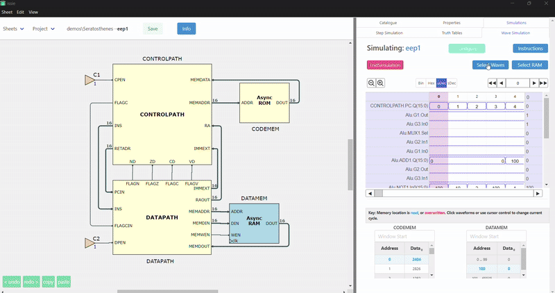

# Breadcrumb-based Waveform Selector Overview

This document focuses on the **Breadcrumb-Based Waveform Selector** in Issie. It describes how we implemented an intuitive hierarchy-based UI for selecting waveforms in complex designs.

---

## Table of Contents
1. [Project Overview](#project-overview)
2. [Feature Summary in User-Story Format](#feature-summary-in-user-story-format)
3. [UI Decisions & Rationale](#ui-decisions--rationale)
4. [Code Structure & Documentation](#code-structure--documentation)
   - [File Structure](#file-structure)
   - [Key Non-Trivial Functions](#key-non-trivial-functions)
5. [Building and Running](#building-and-running)
6. [Future Enhancements](#future-enhancements)
7. [Acknowledgments](#acknowledgments)

---

## Project Overview

Issie’s existing waveform selection dialog was difficult to use on large or deeply nested designs. Our goal was to improve this by introducing:
- **Breadcrumb Navigation** to provide an at-a-glance hierarchy view.
- **Flexible Search Filters** for sheets, components, ports, wave names, and component types.
- **Bulk Selection/Deselection** to quickly toggle multiple waveforms.
- A **Unified Modal Dialog** that cleanly displays all relevant controls and results in one place.

This **Project B** focuses solely on the breadcrumb-based waveform selector; it does **not** address any features related to parameterized design sheets.

---

## Feature Summary in User-Story Format

1. **User-Friendly Hierarchy**  
   *As a user, I want to see a hierarchical breadcrumb trail of sheets, so I can quickly navigate and find waveforms deep in nested designs.*

2. **Powerful Search & Filter**  
   *As a user, I want to filter waveforms by substring, sheet name, component name, port name, or type, enabling me to narrow down to just the signals I need.*

3. **Bulk Actions**  
   *As a user working with dozens of signals, I want a quick way to toggle all signals at once, speeding up repetitive selection tasks.*

4. **Immediate Feedback**  
   *As a user, I want to see how many waveforms I have selected at any time and confirm those selections instantly before simulating.*

5. **Performance & Clarity**  
   *As a user with large hierarchical designs, I expect the UI to remain responsive and intuitive—no cluttered long lists, no unresponsive menus.*

---

## UI Decisions & Rationale

- **Breadcrumb Display on the Left, Selections on the Right**  
  We split the modal into two columns: one for the hierarchy and filtering, and one for the direct list of waveforms. This arrangement helps users visualize where waveforms reside while also managing selections in real time.

- **Multi-Field Search**  
  We provide individual search boxes for sheet names, component names, port names, wave names, and component types. This granular approach (instead of a single text field) gives more precise filtering control.

- **Single, Unified Modal**  
  Rather than scattering wave selection options in multiple areas, we use a full-screen (or large) modal that shows search fields, breadcrumbs, and wave checkboxes together. The user can confirm or cancel all at once.

- **Progressive Disclosure**  
  For wave lists of manageable size, we display details by default. For larger sets, we collapse them to keep the UI cleaner and let the user expand as needed.

---

## Code Structure & Documentation

### File Structure

All new functionality for the breadcrumb-based waveform selector is contained in a **single F# module**:  

Within this file, we organize the logic into the following regions:

1. **Helper Functions & Filtering Logic**  
   - `ensureWaveConsistency` – Prunes invalid or stale wave references.  
   - `filterWaves` – Applies multiple search criteria (sheet, component, port, wave, component type) to produce a filtered set of waveforms.

2. **Search Box UI Components**  
   - `waveSearchBox`, `sheetSearchBox`, `componentSearchBox`, `portSearchBox`, `componentTypeSearchBox` – Each renders a text input, updates the model on change, and triggers re-filtering.

3. **Breadcrumb Display**  
   - `waveSelectBreadcrumbs` – Renders a breadcrumb-style view of sheets, highlighting those with matching results from the filter.

4. **Wave Selection UI (Left Column)**  
   - `toggleSelectAll`, `selectAll`, `toggleWaveSelection`, etc. – Utility functions for quick bulk or individual wave selection, plus associated UI elements (checkbox rows).

5. **Modal Display for Wave Selection**  
   - `selectWavesModalHlp25` – The main modal that ties together the search boxes, breadcrumb display, and wave-list column.

6. **Wave Display Tree**  
   - `makeWaveDisplayTree` – Builds a hierarchical data structure (sheet -> group -> component -> port) from the filtered list of waves.  
   - `implementWaveSelector` – Takes the generated tree and produces the UI (nested tables, checkboxes, expand/collapse rows, etc.).

**Note**: This file references other shared modules and types from the Issie codebase (e.g., `Simulator`, `FastSimulation`, `CommonTypes`), but those are not part of this project’s deliverable.  

### Key Non-Trivial Functions

Below are functions that significantly impact the UI or logic. Each is documented in the source with `///` comments explaining parameters, side effects, and return values.

1. **`filterWaves (wsModel: WaveSimModel) (waves: Wave list) (dispatch: Msg -> unit) -> Wave list`**  
   - Applies user-entered search criteria to filter out non-matching waves.  
   - **Side Effect**: Updates the model’s `HighlightedSheets` based on the filtered waves.

2. **`waveSelectBreadcrumbs (wsModel, dispatch, model) -> ReactElement`**  
   - Builds a breadcrumb-style hierarchy UI.  
   - **Side Effect**: On clicking a breadcrumb, updates the `SheetSearchString` in the model to refocus the filter.

3. **`toggleWaveSelection (index, wsModel, dispatch) -> unit`**  
   - Toggles a single wave from selected to unselected (or vice versa) and regenerates waveforms.  
   - **Side Effect**: Modifies `wsModel.SelectedWaves`, triggers a new simulation wave generation.

4. **`selectWavesModalHlp25 (wsModel, dispatch, model) -> ReactElement`**  
   - Top-level modal that consolidates everything: search fields, wave/breadcrumb layout, and “Done” button.  
   - **Side Effect**: Resets search filters and closes the modal on certain events (e.g., user pressing Done, or wave count > 50 triggers confirmation).

5. **`makeWaveDisplayTree (wsModel, showDetails, wavesToDisplay) -> WaveDisplayTree`**  
   - Recursively partitions waves by sheet, group, and component.  
   - **Side Effect**: None outside of returning the structured `WaveTreeNode` list.

6. **`implementWaveSelector (wsModel, dispatch, wTree) -> ReactElement`**  
   - Renders an interactive table of waveforms using the wave display tree.  
   - **Side Effect**: Hooks up toggles, checkboxes, and expansions to the wave selection logic in `wsModel`.

---

## Post Demo Improvements

Below are the following bugs we noticed during the demo and any improvements our Supevisor mentioned aswell:

- Search bars should be in line with info button and 'X waves selected' test. We should show more value towards vertical height.

- Search bars should be in a fixed position and user should always see them when they scroll up or down.

- Separate scrollbars should be used on breadcrumbs and wave select respectively. Once again vertical height should be mentioned.

- Ensure we're able to select/unselect all waves without issue especially when clicking the 'Done' button

- Correct Breadcrumb sheet should be highlighted when clicked, this mainly applies to the 'leaf' sheets of the hierarchy like 'cond', 'addsub', 'shift1' etc.

We have aimed to solve these additional aims in order to create a Modal design that's capable of satisfying the Supervisor's needs. We have also attempted to implement an auto-complete wave search feature which can be seen [here](https://example.com/your-placeholder) but the CSS styling is preventing the appearance from being able to deal with zooming in and out. The improved result can now be seen in the GIF below:

---

## Future Enhancements

1. **Dynamic Autocomplete**  
   - While typing in a search box, show real-time suggestions (based on actual wave names, sheet names, etc.).

2. **Hierarchical Summaries**  
   - Provide partial counts or icons at each breadcrumb level showing how many waves are selected or match filters.

3. **Asynchronous Tree Loading**  
   - For extremely large designs, lazy-load subtree information to keep initial rendering times low.

4. **Alternative Layouts**  
   - Provide an optional “split pane” so that the breadcrumbs remain fixed on one side while users scroll a large list of signals on the other.

---

## Acknowledgments

- **Contributors**: 
    - Steve Nimo - Nimosteve88
    - Divine Wodi - CB-W03
    - Shree Chandirassegarane - sc3321
    - Amin Mohammed - MaminM
- **Our Supervisor** for feedback on the hierarchical design and search-based UI approach.

